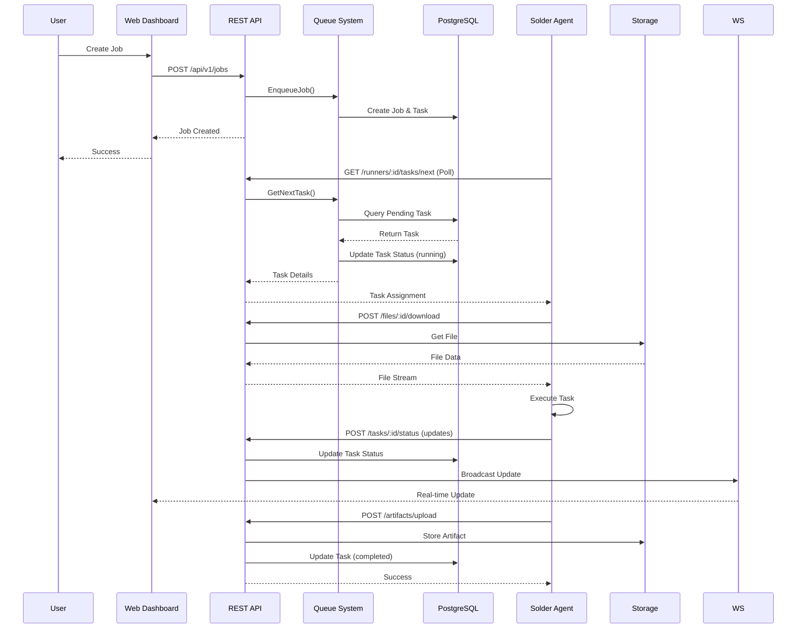

# Borg System Architecture

## System Overview

Borg is a distributed job execution system consisting of:
- **Mothership**: Central coordination server
- **Solder**: Worker agents that execute tasks
- **Web Dashboard**: React-based frontend for monitoring and management

## High-Level Architecture Diagram


## Component Interaction Flow

### Job Submission Flow



### Runner Registration & Heartbeat Flow


## Mothership Internal Architecture


## Solder Agent Internal Architecture

```mermaid
graph TB
    subgraph "Solder Agent"
        Main[main.go<br/>Agent Entry Point]
        
        subgraph "Communication Layer"
            Client[HTTP Client<br/>REST API Client]
            HeartbeatService[Heartbeat Service<br/>30s Interval]
        end
        
        subgraph "Task Execution Pipeline"
            Poller[Job Poller<br/>StreamJobs<br/>5s Interval]
            Downloader[Downloader<br/>File Downloads]
            Executor[Executor<br/>Shell/Binary/Docker]
            Uploader[Uploader<br/>Artifact Uploads]
        end
        
        subgraph "Resource Detection"
            Resources[Resource Detector<br/>CPU, Memory, GPU, IPs]
        end
        
        subgraph "Work Directory"
            WorkDir[./work<br/>Task Workspace]
        end
        
        Main --> Client
        Main --> Resources
        Main --> HeartbeatService
        Main --> Poller
        
        Resources --> Client
        Client -->|Register| API[Mothership API]
        
        HeartbeatService -->|POST /heartbeat| API
        
        Poller -->|GET /tasks/next| API
        Poller -->|Task Assignment| Downloader
        
        Downloader -->|GET /files/:id/download| API
        Downloader --> WorkDir
        
        Downloader --> Executor
        Executor --> WorkDir
        
        Executor --> Uploader
        Uploader -->|POST /artifacts/upload| API
        
        Executor -->|POST /tasks/:id/status| API
        
        style Main fill:#2ECC71,stroke:#27AE60,color:#fff
        style Executor fill:#E67E22,stroke:#D35400,color:#fff
        style Client fill:#3498DB,stroke:#2980B9,color:#fff
        style HeartbeatService fill:#E74C3C,stroke:#C0392B,color:#fff
```

## Data Model Relationships


## Technology Stack

### Mothership (Server)
- **Language**: Go
- **Web Framework**: Gin
- **Database**: PostgreSQL (via GORM)
- **WebSocket**: Gorilla WebSocket
- **File Storage**: Local filesystem (volumes)

### Solder (Agent)
- **Language**: Go
- **Communication**: HTTP REST API
- **Execution**: Shell, Binary, Docker containers
- **Resource Detection**: System calls

### Web Dashboard
- **Framework**: React + TypeScript
- **Build Tool**: Vite
- **Styling**: Tailwind CSS
- **Real-time**: WebSocket client

### Infrastructure
- **Containerization**: Docker & Docker Compose
- **Database**: PostgreSQL 14
- **Volume Management**: Docker volumes

## API Endpoints Overview

### Public API (Web Dashboard)
- `GET /api/v1/stats` - Dashboard statistics
- `GET /api/v1/jobs` - List jobs
- `POST /api/v1/jobs` - Create job
- `GET /api/v1/jobs/:id` - Get job details
- `POST /api/v1/jobs/:id/pause` - Pause job
- `POST /api/v1/jobs/:id/resume` - Resume job
- `POST /api/v1/jobs/:id/cancel` - Cancel job
- `GET /api/v1/runners` - List runners
- `GET /api/v1/runners/:id` - Get runner details
- `GET /api/v1/tasks/:id/logs` - Get task logs

### Runner API (Solder Agents)
- `POST /api/v1/runners/register` - Register runner
- `POST /api/v1/runners/:id/heartbeat` - Send heartbeat
- `GET /api/v1/runners/:id/tasks/next` - Get next task
- `POST /api/v1/tasks/:id/status` - Update task status
- `GET /api/v1/files/:id/download` - Download file
- `POST /api/v1/artifacts/upload` - Upload artifact

### WebSocket
- `GET /ws` - WebSocket connection for real-time updates

## Deployment Architecture


## Security Considerations

1. **Authentication**: Token-based authentication for runners
2. **Authorization**: Runner registration requires valid token
3. **Network**: Runners communicate via HTTP (can be upgraded to HTTPS)
4. **File Storage**: Files stored in isolated volumes
5. **Database**: Credentials via environment variables

## Scalability Notes

- **Horizontal Scaling**: Multiple Solder agents can be deployed
- **Load Distribution**: Queue system distributes tasks based on runner capacity
- **Concurrency**: Each runner can handle multiple concurrent tasks
- **Database**: PostgreSQL supports high concurrency
- **WebSocket**: Hub handles multiple concurrent connections

